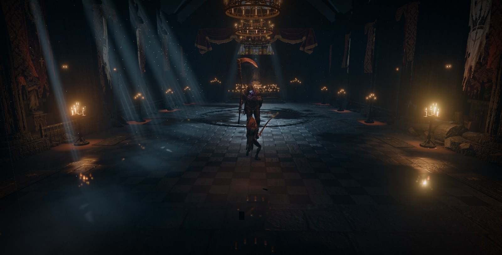

# Lost Cathedral



Play it on Genex: https://genex.games/lost-cathedral

(Working title through development: Vesper — The Last Rite. Renamed 17 Sep 2026 for the Genex release; the hosted slug is `lost-cathedral`.)

A playable local third-person gothic boss encounter: the approved **Thorn Exile** versus **Armored Death**, with the approved scythe gripped in both hands. Built with Three.js and Vite; generated assets are local files.

## Play

```sh
npm install
npm run dev -- --port 5179
```

Open http://127.0.0.1:5179/. For the production build:

```sh
npm run build
npm run preview -- --port 4174
```

Open http://127.0.0.1:4174/. Keyboard and mouse on the desktop, touch controls on phones and tablets; WebGL 2 required.

| Action | Control |
|---|---|
| Move | WASD |
| Light / heavy attack | Left click or J / K |
| Forward shoulder roll | Space |
| Block | Hold right mouse or L |
| Heal | R — three draughts |
| Lock on | Q or middle mouse |
| Free camera | Release lock, then drag; double-click captures mouse |
| Camera distance | Mouse wheel |
| Pause, graphics, audio, controls | Escape |

On a phone or a tablet the game takes its own path (v1.1.0, `src/game/device.js`): a floating stick on the left, drag to look and pinch to zoom on the right, and Strike (tap, tap again to combo, hold for heavy), Roll, Guard, Draught, Lock and Pause buttons; a lighter rendering preset (Performance by default, a pixel budget instead of the desktop's ratios, no contact AO, no puddle mirror below High, half-size shadow maps, 18 lights per pixel instead of 28, no SMAA at Performance) and phone copies of the six heavy models with their 4096-px maps resized to 1024 (`assets/mobile/`, made by `scripts/make-mobile-assets.py`; mesh, rig and clips identical) so the load fits a phone's memory. The desktop rendering is untouched; `?touch=1` shows the touch layer on a desktop. Notes: `docs/mobile-2026-09-17/README.md`.

Settings include movement and shield toggles for users who prefer pressing once over holding keys. Release your shield during recovery to regenerate stamina faster. Both phases have deliberate windups, committed attacks and punish windows. Retry is available after either outcome.

## Assets and authoring

- Uthana supplies humanoid skeletons and locomotion; Blender solves and bakes equipment poses and combat actions.
- The player uses the untouched approved mesh rebound to the humanoid skeleton. This avoids the auto-rigger's damage to the large ornamental pauldron. UVs and materials are preserved.
- Shield, sword, scythe and loose cloth remain separate. The shield is a 0.95 m centre-grip mount solved from the guard pose (`scripts/solve-shield-mount.mjs`): face toward the opponent, upright, tucked back along the forearm only while the roll tumbles. Cloth uses separately attached, damped drapes with inertia, gravity and simple body/floor limits. It is an approximation rather than full fabric self-collision.
- Load-time clip adjustments are declared per clip in the player manifest and applied by `src/game/clip-adjustments.js` and the animation controller, never by editing the GLB: the captured guard family (idle, block, hit, light) turns −35° so the performer's head-left gaze faces the opponent, blended by animation weight; the heavy stays square because its narrow overhead chop misses otherwise (`scripts/sweep-player-stance-yaw.mjs`); a left-hand twitch in idle/block is removed by a loop-aware 0.6 s Gaussian on the left arm chain (292 → 28 deg/s). **Facing lines** in the studio (cyan head, amber pelvis, white gameplay facing) and the in-game performance monitor show the result; `scripts/inspect-player-pose.mjs` measures it.
- The selected runtime files and timing manifests are declared in `src/game/asset-paths.js`. The current player is `assets/player-motion-revision-3/player-video-candidate-v17.glb` (manifest `docs/player-motion-revision-3/player-video-candidate-v17-manifest.json`): the V15 bundle (text-directed Uthana run chosen by the user, 0.93 s cycle, `locomotionSpeed` 2.3 m/s; captured idle, block, hit, heal, roll and death) with the light and heavy attacks replaced by the user's own Sword 4 clips (`Sword_hit1`, `Sword_hit3`) retargeted to the rig by `scripts/blender/player_replace_attack_clip.py`, shield arm braced out of the cut, hit windows from measured blade contact. At runtime `src/game/gaze-lock.js` turns the head toward the lock-on target, `src/game/shield-strap.js` keeps the shield on the forearm through the roll, and rolls follow the held direction (`src/game/motion.js`). Notes: `docs/player-motion-revision-3/README.md` (attacks), `docs/player-motion-revision-2/README.md` (run), `docs/overnight-2026-09-16/README.md` (the 16 Sep upgrade: cathedral, UI, effects, cloth, roll).
- [Animation studio](http://127.0.0.1:4174/animation-review.html): choose Boss or Player, then click a move to play it. Direct links accept `?character=player&clip=idle&time=1&view=side&facing=1` (add `&gaze=0` to see the captured head without the gaze lock; "Head tracks the opponent" in the sidebar does the same); `scripts/studio-capture.mjs` renders such links headlessly for review stills, and `scripts/browser-playtest.mjs` drives real key input through the game page. Space pauses; drag the timeline or use the arrow buttons to inspect a pose. Character, Hands and Head provide close-ups; Fit view restores the full movement. [Inspector guide](docs/animation-inspector.md). [Simple motion videos](http://127.0.0.1:4174/motion-videos.html) are available with ordinary playback controls.
- Historical assets and the many-armed boss are preserved. The old model viewer is `/asset-review.html` on the development server.
- [Production assets and rig notes](docs/production-assets.md), [visual reference sources](docs/visual-references.md), [current visual revision review](docs/combat-revision/root-visual-review-20260915.md), [historical overnight verification](docs/overnight-qa.md), [earlier verification archive](docs/production-qa.md).

## Validate

```sh
npm test
node scripts/simulate-encounter.mjs
npm run build
```

Tests cover combat rules, movement, swept weapon contacts, phase changes and resets. The runtime audits load the selected rigs and timing manifests, while focused tests cover the approved boss idle, body movement, blade reach and grip behavior. Archived first-bundle tests are labelled separately.

`npm run verify` runs the tests, actual weighted-sole audit, foot-contact event audit, complete encounter simulation at three update cadences, and production build. It records asset hashes and per-stage logs in `docs/current-build-verification.json`. These checks complement the visual and browser play review; they cannot certify natural-looking motion by themselves.

The boss's approved quarter-speed idle is baked into its 26.27-second clip and plays at normal runtime speed. New combat movement uses Uthana video extraction with Blender stance, grip and weapon corrections. The revised player light and overhead heavy attacks use separate selected video captures. A captured forward shoulder roll replaces the earlier backward hop. Guard, idle and the full-body catch-step reaction also have corresponding reference and corrected-model videos in the gallery.

Current motion notes and rebuild entry points:

- Boss revision: `docs/combat-revision/README.md`; earlier production body/idle bundle remains preserved.
- Player revision: `docs/player-combat-revision/README.md` and `comparison-manifest.json` record the selected sources, raw captures, selected V6 export, proof movies and measured tolerances. The approved mesh and all 16 locomotion clips remain preserved.
- Runtime: `docs/runtime-motion-contract.md` describes blending, input, contact and foot correction.
- [Why the earlier motion looked wrong](docs/motion-corrections-explained.md) explains the causes, corrections and remaining limits.
- Graphics and cloth: `docs/environment-cloth-pass.md`; recessed hood smoke and reflective puddles: `docs/hood-and-puddles-review.md`.

The production build uses HDR rendering, ACES tone mapping, MSAA, SMAA, contact AO on High, and restrained bloom. High uses a 1.15 maximum pixel ratio; Balanced uses 1.0. Irregular puddles reflect the scene on High and Balanced; Low retains the wet surface without the reflection pass. Recessed animated smoke fills the boss’s hood aperture and responds to combat. Weapon and boot sounds are spatially placed with a quiet room response. Elden Ring and Dark Souls III are documented art references; this is an original browser encounter with its own assets, not a claim of AAA visual parity. The game is published on Genex (https://genex.games/lost-cathedral); updates go to the draft page first (`npx genex preview`) and public on `npx genex promote`.
